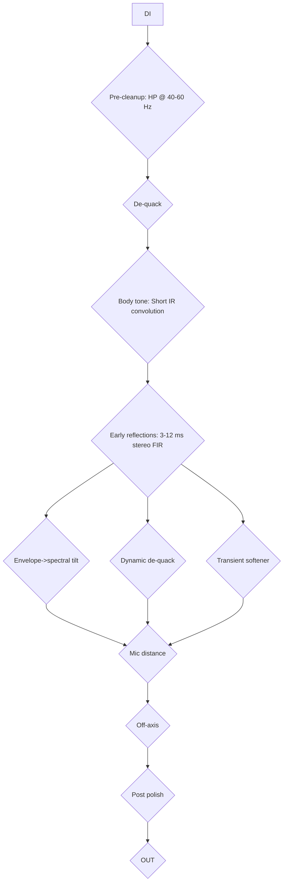

# Acoustic notes

Potential ideas to model acoustic signal from a electric guitar DI.

Differences between electric and acoustic:

- DI (pickup) = string excitation: clear, dry, little body
- Mic'd acoustic = excitation * body/air transfer + room/mic color (as reverb)

Need a $T(f)$ transfer function that turns DI into a mic-like tone + layer amplitude and transient-dependent tweaks.

## Signal Flow

